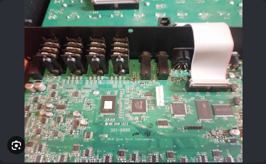
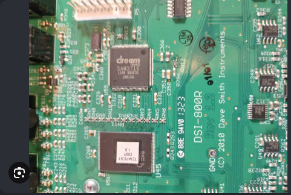
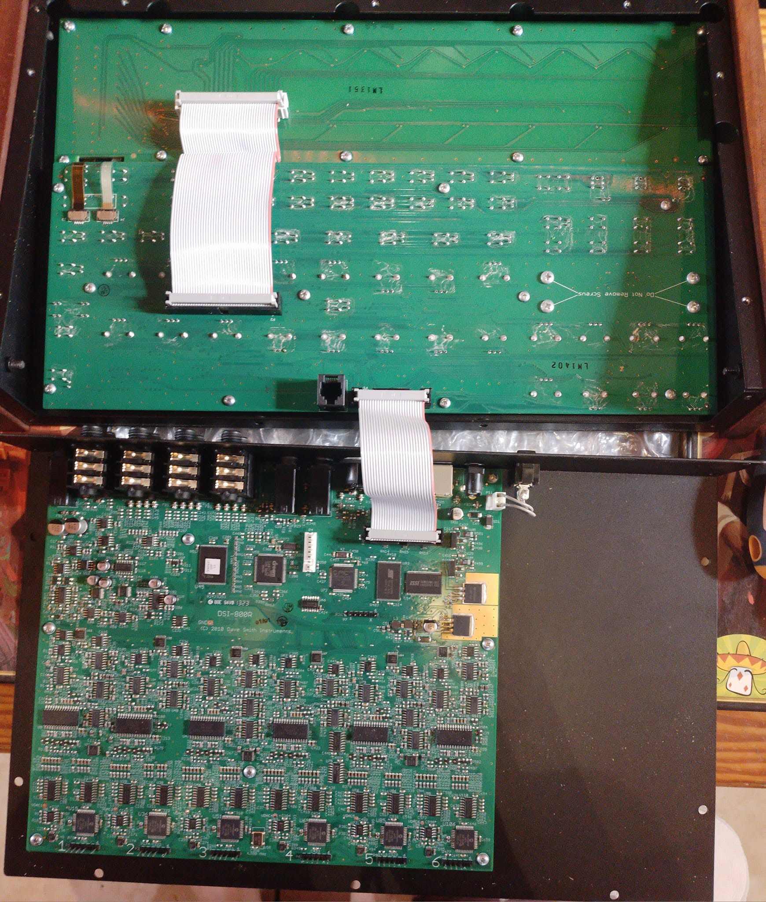
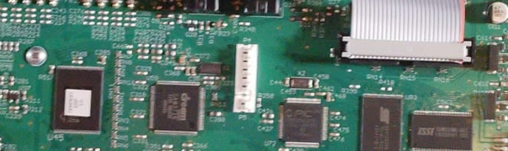
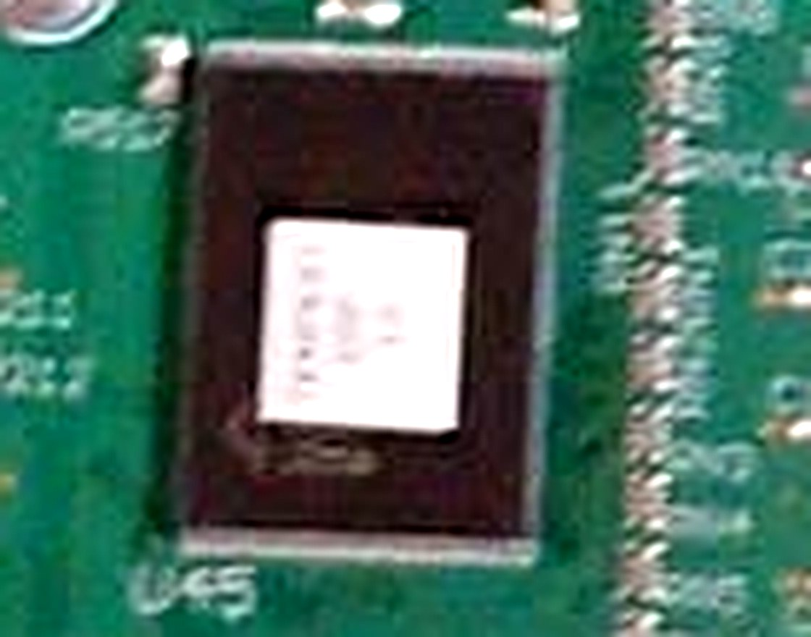

# Tempest Firmware Analysis - Research Notes

This document collects what's been learned about the Tempest's own internal
firmware - the code that actually runs on its processors - as distinct from
[docs/sysex-tempest-format.md](sysex-tempest-format.md), which covers the
SysEx wire protocol used to talk to the Tempest over MIDI. The two are
related: some of this investigation's motivation is that the firmware
contains readable strings ("Failed to read sequence data" and similar)
directly relevant to the still-open Export Beat multi-note question in the
SysEx doc (§9.4-9.6) - if the firmware's sequence-read/write code can be
found and read, it could explain that bug directly, rather than continuing
to guess at it from the outside via more hardware captures.

**Status as of 2026-09-22: architecture and chip identities are confirmed.
The byte-precise memory layout needed to actually read the interesting code
is not resolved, and multiple independent attempts to solve it did not
succeed.** This is a working state, not a finished investigation - read
through to the end before assuming anything or spending more time
re-attempting what's already been tried.

---

## 1. The firmware itself

The Tempest's operating system is distributed as a MIDI SysEx bulk dump, the
same transport mechanism `tempest-mcp` already uses for sound/beat/project
data. Download from
[sequential.com/support/download/tempest-operating-system](https://sequential.com/support/download/tempest-operating-system/)
(`Tempest_OS_1.5.0.2.zip` as of this writing) - a zip containing **four
separate `.syx` files, one per processor**:

| File | Processor | SysEx type byte |
|---|---|---|
| `Tempest_Main_1.5.0.2.syx` | Main | `0x71` |
| `Tempest_Voice_1.5.syx` | Voice | `0x72` |
| `Tempest_Panel_1.3.syx` | Panel | `0x73` |
| `Tempest_Sam_1.1.syx` | SAM | `0x74` |

This confirms the OS readme's own claim: "Tempest has four different
operating systems, one for each of the different types of processors that
control its functions." These four type bytes are a distinct message family
from the `0x60`/`0x61`/`0x63`/`0x5C`/`0x5E`/`0x5F` Sound/Beat/Project family
documented in the SysEx format doc.

Each file unescapes cleanly with `tempest-mcp`'s existing
`sysex.Unescape7Plus1` (the same collector-first scheme already confirmed for
Sound/Beat/Project data), using a plain 4-byte header (`F0 01 28 <type>`) -
no special-casing needed beyond what the repo's `sysex` package already
knows, other than that `sysex.Identify` doesn't currently recognize these
four type bytes (they decode to `TypeUnknown`), so the standard
`beat-mapper unescape`/`diff` CLI commands don't work on them directly (they
skip unrecognized types). Manually stripping the 4-byte header and calling
`sysex.Unescape7Plus1` on the rest works fine.

## 2. Confirmed: two different processor architectures, not four

**Main and Panel are MIPS32, little-endian - a Microchip PIC32 (MIPS M4K
core).** This is instruction-level confirmed, not a guess:

- Both files' early bytes decode as clean, unambiguous MIPS32 instructions
  when disassembled with the `capstone` Python library
  (`CS_ARCH_MIPS + CS_MODE_MIPS32 + CS_MODE_LITTLE_ENDIAN`) - real function
  prologues (`addiu $sp,$sp,-N` / register `sw` saves / `lui`), not
  coincidental bit patterns.
- Panel's firmware additionally contains genuine `mfc0`/`mtc0` COP0-register
  instructions - these only appear in exception/interrupt-handling code or
  rare low-level configuration, so this is real evidence of a real MIPS
  exception-handling environment, not noise.
- This independently corroborates (via primary-source binary analysis, not
  just the secondhand claim) an unverified Gearspace forum post describing
  the Tempest's main processor as "a PIC32 running at 80MHz." Note: that
  specific claim traces back to a post that reads as being about the
  **Prophet 12** (a different, later Sequential/DSI product using SHARC DSPs
  for audio and a PIC32 for the main OS) more than the Tempest specifically -
  plausible that DSI reused the same control-MCU platform across the product
  line, but that's inference, not a confirmed direct source for the Tempest.
  The instruction-level confirmation above stands on its own regardless.

**Voice and SAM are not MIPS, and not any commonly-documented architecture.**
No MIPS prologue or COP0 signature appears anywhere in either file. Real
Tempest hardware photos (see §4) confirm what they actually are:

- **SAM** is a **Dream S.A.S. SAM3716** - a real, if obscure, off-the-shelf
  part ("SAM" in the firmware filename is literally this chip's product
  name, not project-specific). Its datasheet describes 16 on-chip
  proprietary "P24" DSP cores (2k×24 RAM + 1.2k×24 ROM each, 24-bit data /
  96-bit coefficient resolution), built for audio matrix-mixing/effects
  applications. This architecture is undocumented publicly beyond
  block-diagram level - no public instruction set reference, no accessible
  disassembler or toolchain exists for it (even hobbyist forums report being
  unable to find a full datasheet). **Not realistically reversible with
  available tools.**
- **Voice** is a chip Sequential/DSI had custom-labeled **"TEMPEST DSP 1.0"**
  on the board silkscreen instead of showing its real manufacturer part
  number (a common OEM practice). Its real identity is unknown. Given its
  position on the board right next to the SAM chip in the audio section, and
  that Voice's firmware shows the same "not MIPS, not identifiable" pattern
  as SAM, it's reasonably assumed to be similarly out of reach - not
  independently confirmed.

**Practical conclusion: the Main/Panel MIPS path is the only one of the four
processors with a realistic path to further reverse engineering.** Ghidra,
`capstone`, and general MIPS/PIC32 knowledge all apply there. Nothing
comparable exists for the other two.

## 3. Confirmed: Main and Panel are almost certainly the same PIC32 part

Comparing the *unescaped* headers of Main and Panel directly (not the
escaped wire bytes, which don't compare 1:1 across files due to the
collector-first scheme's per-group structure):

```
Main:  05 f3 40 0f 00 00 00 00 ff ff 00 10 00 00 00 00
Panel: 9a 01 40 0f 00 00 00 00 ff ff 00 10 00 00 00 00
```

**14 of 16 bytes are byte-for-byte identical**, with only the first 2 bytes
differing. This is consistent with those first 2 bytes being a per-file
checksum (varies with content, as a checksum should) and the rest being
fixed structural data shared by both files - which in turn is consistent
with Main and Panel targeting the exact same PIC32 part number, not just the
same architecture family. Practical implication: if Panel's physical chip
marking can ever be read (its board may be smaller/less crowded/more
photographable than the main analog board that hosts the audio chips), that
would answer the "what exact PIC32 variant" question for Main too.

Tested whether the first 2 bytes are a simple checksum over the rest of the
payload (byte sum, 16-bit sum, XOR, the classic Roland 7-bit checksum
convention) - none matched. Doesn't rule out a checksum (there are many
possible algorithms - CRC-16/32, different included byte ranges, etc.),
just means the common simple ones aren't it.

The `ff ff 00 10` bytes (positions 6-9) initially looked like a plausible
flash-page-size field (`0x1000` = 4096, a common PIC32 flash erase-page
size, with `0xffff` as an adjacent erased-flash sentinel) - but the same
8-byte pattern (`ff ff 00 10 00 00 00 00`) appears to repeat at the next
8-byte boundary in Panel's header too, which looks more like plain
`0xFFFF`-padded reserved/unused space than a deliberately meaningful field.
Treat that specific guess as walked back, not confirmed.

## 4. Physical board identification

Real Tempest mainboard photos (found via image search, sourced from a public
Facebook post "Analog drum synthesizer Tempest by Dave Smith Instruments" in
the "I Take Pictures of Electronic Parts" group) show the board silkscreened
**`DSI-800R Rev 1.2`, `(C) 2010 Dave Smith Instruments`**.



- A chip clearly marked **`dream SAM3716`** - the SAM processor (§2).
- A chip custom-labeled **`TEMPEST DSP 1.0`** - almost certainly the Voice
  processor (§2), real identity hidden by the re-badge.



- Six repeated identical small-IC clusters, consistent with the manual's
  "six powerful analog synthesis voices."

**A higher-resolution version of the same album was later found and pulled
directly from the Facebook post (1740x2048, vs. the ~520x320 first-pass
copy above) - this changed the picture meaningfully:**



This shows there are (at least) **two separate boards** in the unit: a top
board that is a pure button/LED matrix (rows of pad footprints, a ribbon
connector, "Do Not Remove Screws" silkscreen, no IC larger than a shift
register/driver visible anywhere on it) sitting above the main `DSI-800R`
board seen in the original two photos. **This board is most likely the
physical pad/keypad panel specifically, not necessarily "the Panel processor
board" in the SysEx-firmware sense** - if Panel's PIC32 lives on a third,
still-unphotographed board, or off-frame on one of these two, that's still
unresolved. Worth remembering next time "Panel" comes up: the firmware name
and the physical board name may not refer to the same board.

The main board's control-MCU cluster is now visible clearly enough to be
useful:



- **`U45`** (leftmost chip in the cluster) is the strongest remaining
  candidate for Main/Panel's PIC32 by position (directly beside the
  ribbon-cable connector to the panel/button board) and package size.
- Next to it, a **second `dream`-logo chip** - most likely the same
  `SAM3716` already identified elsewhere on this board (same board,
  different framing), not a second distinct part; not fully confirmed
  either way from this angle.
- An **`ISSI`-branded memory chip** (Integrated Silicon Solution Inc, a
  real SRAM/Flash vendor) sits in the same cluster - consistent with a
  classic "MCU + external SRAM" arrangement, circumstantial support for
  `U45` being the actual controller rather than an unrelated chip.

**`U45`'s marking is physically hidden, not just hard to photograph:**



Zooming into `U45` at full resolution shows the white square isn't a flash
reflection (the working assumption from the earlier, lower-res photos) - it's
a **paper label glued directly onto the chip package**, with faint rows of
printed text on it that are below this photo's legibility floor. This is the
same playbook already seen on the Voice chip (re-badged "TEMPEST DSP 1.0" on
the silkscreen) applied differently: here, instead of relabeling in
silkscreen, DSI covered the chip's own factory-printed marking directly.
**Practical implication: no clearer photo of this specific unit's `U45` will
ever reveal the part number** - the marking is physically obscured, not
merely blurry. A different unit from a different manufacturing batch
(possibly without the label applied), the label peeled back, or the chip's
topside markings visible from a raking/angled light photo are the only ways
this specific angle could still resolve. Reasonable circumstantial evidence
this deliberate concealment happened *at all* is itself worth noting: DSI
apparently wanted to obscure their MCU sourcing for both Voice (silkscreen
re-badge) and, if `U45` really is Main/Panel's PIC32, this chip too (opaque
label) - suggesting board-level obfuscation was a deliberate choice, not
incidental.

**Searching for the exact PIC32 part number came up empty, and this looks
like a real dead end for the search-based approach specifically:**

- `fccid.io` and the FCC's own legacy equipment-authorization search are
  both impractical to query this way (bot walls on the former; the latter's
  legacy form needs a grantee code as a starting point, which isn't known).
  **Checked the actual manual text directly (not just searched for it): the
  Tempest's FCC section is only the generic Part 15 Class B "verification"
  statement, no ID code or grantee code anywhere.** That tier of compliance
  applies to wired-only devices with no RF transmitter, which typically
  never receive an individual FCC ID at all - this is likely why the FCC
  equipment-authorization search came up empty, not a search-quality
  problem. Treat the FCC-ID angle as structurally closed, not just
  under-searched.
- No schematic, service document, or FCC filing is indexed anywhere under
  the exact board revision `"DSI-800R"`.
- Direct `"PIC32"` + Tempest photo/text searches turn up essentially
  nothing relevant.
- Checked marketplace/parts sources for board-level photos beyond the one
  Facebook album: Syntaur has no parts listed for the Tempest at all;
  Reverb's marketplace search for board/parts listings returns only knobs,
  rack ears, and unrelated EPROM listings; a YouTube search for
  teardown/repair content returned only demo and tutorial videos. eBay was
  not checked past its bot-detection challenge page (not attempted to
  bypass). None of these turned up a second photographed unit.
- The 2010 board date does at least confirm the chip must be a **PIC32MX**
  family part, not PIC32MZ (which wasn't released until ~2013) - narrows
  which vector-spacing convention applies, but doesn't give the specific
  variant.

**Two possible physical debug-access points spotted in the hi-res photo,
neither confirmed:**

- A **6-pin single-row header labeled "P4"**, positioned directly beside
  `U45` and its neighboring `dream`-logo chip - i.e. right where you'd route
  short traces for an in-circuit debug connection to the MCU cluster. Six
  pins matches Microchip's standard ICSP header count exactly (`MCLR`,
  `VDD`, `VSS`, `PGD`, `PGC`, plus one more, often `AVDD` or NC). No
  pin-label silkscreen legible at this photo's resolution to confirm the
  signal names.
- An **RJ11/RJ12-style modular jack** (6 gold contacts) on the panel/button
  board, mounted right where the inter-board ribbon cables also connect.
  Genuinely ambiguous from a photo alone - could be a compact internal
  wiring-harness connector (common in consumer gear, e.g. to a separate
  display sub-board), or could be a service/debug port using a phone-jack
  shell instead of a pin header (PIC32's 2-wire ICSP plus power/ground fits
  comfortably in 6 conductors, so this isn't implausible either).

**If physical access to a unit is available, this is a categorically
stronger path than anything else in this section**: continuity-testing
either connector against the known PIC32 ICSP pinout with a multimeter, or
simply trying a PICkit/ICSP programmer against "P4" directly, would read the
chip's device ID straight from silicon - settling the exact part number
outright - and could enable a full flash dump with real, hardware-reported
addresses, bypassing the entire base-address problem in §5 rather than
solving it computationally.

### 4.1 DSI reused this control platform across other products - a real, independent lead

The Tempest is not the only DSI/Sequential product built around a PIC32
control board, and some of the others are far more actively discussed and
modded by the community than the Tempest is - meaning their exact chip may
already be identified somewhere the Tempest's isn't.

- **A Gearspace repair thread confirms the OB-6 and Prophet-6 "share the
  same architecture"** at the main-board level (the poster replaced a
  failed OB-6 mainboard - which also carries the USB port - under a $25
  DSI service exchange). The thread's own attached photos are dead links
  (2018-era third-party image hosting, since removed) - a checked, real
  dead end for *that specific thread's photos*, not for the underlying fact
  it confirms.
- **A ModWiggler teardown thread of a Dave Smith Mopho keyboard** (an
  earlier, simpler DSI product, ~2009) states in plain hobbyist language:
  *"The mainboard, voice + controlling microcontroller (PIC32), is quite
  small. A dsPIC seems to be used for the DCOs."* This independently
  corroborates PIC32 as DSI's standard control MCU choice well outside just
  the Tempest, from a source with no connection to this investigation. The
  thread has an attached close-up main-board photo (`IMG_3504.jpg`,
  captioned "close-up of the main board") that could plausibly show a
  legible part number - **gated behind free ModWiggler forum registration,
  not publicly viewable, so not fetched.** If accessible another way (a
  ModWiggler account), this is a concrete, specific image already known to
  exist, not a speculative search.
- **Sequential hosts official, photographed main-board removal guides** for
  several *current* products (Prophet-5/10, Prophet X/XL) at predictable
  URLs (`sequential.com/<product>-main-board-removal/`) - confirmed no
  equivalent page exists for the Tempest (`sequential.com/tempest-main-board-removal/`
  404s, and a site search for "tempest main board" returns nothing
  relevant), consistent with the Tempest being long discontinued and
  outside their current support-doc priorities. Worth checking the *current*
  product guides' own photos for a legible PIC32 if the goal shifts from
  "identify Tempest's exact chip" to "identify DSI's standard chip across
  the whole platform lineage" - not done this session, since the Prophet-5/10
  reissue postdates the Tempest by roughly a decade and may use a different
  chip generation even if architecturally similar in spirit.

**Practical implication:** if asking in the Tempest-specific Gearspace
thread (§7) doesn't get a response, the OB-6/Prophet-6/Mopho communities are
larger, more active, and more likely to have already done this identification

- worth asking there too, framed as "what control MCU does the OB-6/Prophet-6
use" rather than Tempest-specifically, given the shared-architecture claim.

### 4.2 Downloaded and directly compared OB-6 and Mopho firmware - real progress, still not a full solve

Followed up on §4.1 by actually pulling the two sibling products' official
firmware and running them through the same pipeline as Tempest's, rather
than relying on secondhand forum claims. Both downloaded from official
sources: `Mopho_Main_1.4.syx` (`sequential.com`, 2010 release) and
`OB6_Main_1.8.0.syx` (`oberheim.com`, 2024 release - the current OS as of
this session, giving a much newer toolchain build than Tempest's 2017
`1.5.0.2`).

**Wire format is shared platform-wide.** Both files use `F0 01 <device
byte> <type byte>` headers structurally identical to Tempest's (`01 28`) -
Mopho uses `01 25`, OB-6 uses `01 2e`. Stripping the same 4-byte header and
running the same collector-first 7+1 unescape (`sysex.Unescape7Plus1`)
against OB-6's payload works cleanly. This is useful independent
confirmation that this repo's wire-format implementation is a real,
general DSI/Sequential convention, not something reverse-engineered to fit
Tempest specifically.

**OB-6 decodes as clean MIPS32/PIC32 immediately, and gives a stronger
address clue than anything found for Tempest.** Byte 0 of OB-6's unpacked
payload is an unambiguous reset stub:

```
lui $k0, 0x9d0c
addiu $k0, $k0, 0x4680
jr $k0
nop
```

Unlike Tempest's `jal`-based stub (§5.4, which only encodes 28 of the
target's 32 bits, forcing a guess at the top nibble), this `lui`+`addiu`
pair spells out the **full 32-bit target explicitly: `0x9D0C4680`**. This is
a real, independent confirmation that `0x9D` (KSEG0 cached program flash) is
the correct segment convention for this whole DSI/Sequential platform -
previously only an assumption for Tempest, now directly demonstrated on a
sibling product's own firmware.

Tried to use this to actually pin down a base address: computed the naive
file offset (`0xC4680` under a `0x9D000000` base) and disassembled there -
it doesn't land on clean, recognizable code. Swept ±8KB around that offset
looking for a real function prologue (`addiu $sp,$sp,-N`) - no clear winner,
same inconclusive shape as every base-address attempt in §5. **This sub-problem
remains open for OB-6 too, not just Tempest** - the full-address confirmation
narrows *which segment*, not *where in the file*.

**Also generalizes a Tempest-specific finding into a platform-wide one:**
searched OB-6's firmware - built in 2024, a vastly newer toolchain than
Tempest's 2017 build - for the stock XC32 NMI-check preamble (§5.4, §5.5).
Still absent, same as Mopho and Tempest. **"DSI writes custom startup
assembly instead of linking the stock library crt0.o" is not a Tempest
quirk or a toolchain-era artifact - it holds across at least three products
spanning 2010 to 2024.** This closes the door a little further on ever
finding a stock-crt0 reference to diff against, for any product in this
family, not just this one.

**Mopho did not decode cleanly at all.** Tried header lengths 3 through 7
bytes (in case this older, simpler 2010 product uses a different header
convention than Tempest/OB-6) - none produced a recognizable reset-stub
pattern the way Tempest and OB-6 both did immediately. Most likely
explanation: Mopho, the oldest and simplest product in this lineup, uses a
genuinely different wire or escape format - not investigated further this
session given time already spent; a real open question if picked up again,
not a dead end that's been ruled out.

## 5. The base address problem

This is the actual blocker. To do anything useful with Ghidra (cross-reference
strings back to the code that uses them, read the Export Beat logic, etc.),
the tool needs to know the correct virtual load address the firmware is
compiled/linked against - loading it at the wrong address makes every
absolute address reference in the code resolve to nonsense.

**What's confirmed:** Microchip's standard PIC32 convention places the
exception vector base (`EBase`) at `0x9D000000` (KSEG0, cached program
flash), with the general exception vector at `EBase + 0x180` per the
`procdefs.ld` linker script convention (confirmed via Microchip's own
developer documentation and a real example linker script, though for a
different, smaller-flash PIC32MX variant than whatever Sequential actually
used - the *convention* transfers, the *exact vector table size* may not).
Panel's firmware shows COP0 (`mfc0`/`mtc0`) activity clustered in a pattern
plausibly consistent with this (early activity around file offset 0x1c-0x38
looking like CRT0 startup register configuration, a denser cluster around
0x1a4-0x1d8 plausibly matching the `EBase+0x180` general exception vector if
file offset 0 ≈ `EBase`) - but this is "consistent with," not "proof of," a
byte-precise base address.

**Four independent attempts to solve the exact base address algebraically
were tried, and none succeeded:**

1. **Global string correlation.** For every `lui`+(`addiu`|`ori`)
   same-register instruction pair in Main's firmware (217 found - each
   yields a fixed 32-bit "computed address" from the instruction encoding
   alone, independent of any base guess), correlated against the file
   offsets of every string Ghidra's own analysis had detected (265 of them).
   Voted for `candidate_base = computed_address - string_offset` across all
   ~57,500 combinations and histogrammed the result. No spike - top
   candidate got 16 votes with a smooth, gradual falloff (16, 16, 15, 15,
   14...) indistinguishable from coincidence.
2. **Narrowed string correlation.** Same vote data, re-filtered to only a
   tight ±0x4000-byte window around the trusted `0x9D000000` guess (~5300
   candidates instead of the full 32-bit space). Still no spike - top
   candidate got 13 votes against an equally smooth gradient.
3. **Global call-target correlation.** A different, in-principle cleaner
   anchor category: `J`/`JAL` call-instruction targets (whose low 28 bits
   are fully determined by the instruction encoding, independent of base,
   assuming KSEG0's top nibble `0x9`) correlated against function-prologue
   locations (`addiu $sp,$sp,-N` patterns) rather than arbitrary string
   data, since calls should overwhelmingly target real function entry
   points. Found 5689 candidate call targets (most likely mostly spurious -
   `J`/`JAL`'s opcode is only 2 of 64 possible 6-bit values, so roughly 3%
   of *any* 32-bit word matches by chance alone) against only 29 real-looking
   prologues across the whole 525KB file. Diffuse, unconvincing top result
   (4 votes).
4. **Narrowed call-target correlation.** Same technique restricted to just
   the first 16KB (the region with the strongest independent evidence of
   being real code, near the vector table). Found only **1** prologue in
   that entire range - at file offset `0x10`, the same location originally
   guessed as "the entry point" - too few anchors for any statistical signal
   at all.

5. **Pointer-table correlation.** A follow-up session noticed that the
   twelve `"Failed to ..."` strings (§5.1) sit in one tight, contiguous
   block - the signature of a `const char* error_messages[]` table indexed
   by an error code, not twelve separately-referenced literals. Searched for
   that pointer table itself (a run of 4-byte pointers with the same
   relative spacing as the twelve string offsets) two ways: an exact-order
   search (0 hits - the table's real order likely doesn't match the
   strings' file layout) and a flexible any-order pairwise-delta search
   (found large "clusters," but they turned out to be false positives from
   unrelated fixed-stride data elsewhere in the file - e.g. a repeating
   132-byte delta matching this project's own known Sound parameter block
   size, not the error table). With twelve strings there are 132 possible
   pairwise deltas, enough combinations to coincidentally match all sorts of
   unrelated regularly-spaced data in a 525KB file.
6. **SysEx type-byte dispatch search.** Reasoned that code dispatching on an
   incoming SysEx message's type byte would need to compare against several
   of the known type values (`0x5C`/`0x5E`/`0x5F`/`0x60`/`0x61`/`0x63`)
   close together, and searched for them as small immediate constants in the
   code - a search that's base-independent by construction, unlike 1-4
   above. Found a promising-looking cluster referencing `0x5f`, `0x61`, and
   `0x63` together in the trusted early-code region - but disassembling it
   directly showed this was a **false positive**: those bytes are ASCII
   characters (`0x61`='a', `0x63`='c') being stored one-at-a-time to build
   the literal string `"Basic"` (almost certainly a default factory
   sound/beat name), not SysEx-type comparisons. **SysEx type bytes
   (`0x5C`-`0x63`) overlap the printable-ASCII range (`\`, `]`, `^`, `_`,
   `` ` ``, `a`, `b`, `c`) almost exactly, so a bare constant-value search
   can't distinguish "loading a SysEx type for comparison" from "building an
   ASCII string" at the level of a single instruction - worth remembering
   before trusting a similar-looking hit again.** Refined the search to
   require the constant be actually **compared** (`beq`/`bne`) against a
   byte **loaded from memory** (`lbu`/`lb`) nearby, a pattern that should
   only match real dispatch code - zero hits anywhere in the file. Either
   the real dispatch uses a different pattern (a computed jump table indexed
   by the type byte is plausible for a 6+-way switch), the search window was
   too narrow, or it genuinely wasn't found this way.
7. **Jump-table verification - the most rigorous attempt, and the most
   conclusively negative.** Once the toolchain was confirmed as XC32/GCC
   (§5.3), reasoned that a multi-way `switch` (exactly what SysEx dispatch,
   or any similar command dispatch, would compile to) typically becomes a
   **jump table** in GCC-generated code, not a sequence of comparisons -
   explaining why item 6 found nothing. Searched for the specific compiled
   idiom (`sll $reg,$idx,2` immediately followed by an indirect `jr`) - a
   highly selective pattern, only 10 candidates in the whole 525KB file.
   Disassembling the most promising one (file offset `0x3d0`, very close to
   the trusted early-code region) found a genuine, textbook GCC jump table:
   a range check against 40 cases, a `lui`+`addiu` computing a table base
   address, an indexed load, and an indirect jump - unambiguous real
   dispatch code, the clearest structure found all night. **Verified
   whether the table's ~40 entries resolve to valid in-file addresses - a
   much stronger test than anything before, since it requires many entries
   to check out simultaneously, not just one:** 0/40 under the standing
   `0x9D000000` assumption; a coarse full-range sweep (`0x80000000` to
   `0xC0000000`, every 4KB) found no base reaching even 5/40; a fine
   4-byte-resolution sweep across ±128KB around the trusted base found only
   6/40 at best, with no sharp peak. **Reframed to be exhaustive**: instead
   of sweeping candidate base *addresses* (unbounded), swept every possible
   file *position* the table could occupy - bounded by the file's own size
   (~131,000 word-aligned positions), covering literally every base for
   which the table could sit anywhere inside this file. Vectorized with
   `numpy`. **Zero positions in the entire file reach even 10/40 valid
   entries.** This is exhaustive, not "didn't search wide enough" - there is
   no wider window left to try for this specific table under this specific
   validity model. Most likely explanation: this jump table's entries
   aren't simple absolute pointers the way assumed (XC32/GCC can compile
   PIC-style jump tables with PC-relative deltas instead, in some
   configurations - untested) - or this particular 40-case dispatch has
   nothing to do with SysEx types at all.

8. **Direct comparison against XC32's actual crt0.S startup source.**
   Downloaded Microchip's real XC32 v6.00 macOS distribution
   (`xc32-v6.00-full-install-osx.tar.xz`, ~1.4GB) and extracted
   `pic32m-libs/libpic32/startup/crt0.S` - the literal, hand-written assembly
   every PIC32 application links against for its reset/startup sequence,
   rather than inferring it by guessing. First confirmed something genuinely
   new and solid: **byte 0 of both Main's and Panel's raw firmware decodes
   as `jal <target>; nop`** - the exact idiomatic shape of crt0's `_reset:
   jal _startup; nop` stub, with the second word being a true all-zero `nop`
   (not just any nop-decoding value) in both independent files. This is real
   structural evidence both firmware dumps begin exactly at the CPU's entry
   point. But the deeper comparison came back negative: the file's NMI-check
   preamble immediately after (`mfc0 k0,CP0_STATUS` / `ext k0,k0,19,1`,
   unconditional, unguarded by any `#ifdef`) does not appear **anywhere** in
   either binary - checked as a whole-file search for the instruction
   pattern, not just at one guessed offset. Cross-checked this preamble
   against two more independent source snapshots spanning over a decade (a
   June-2013-tagged Microchip mirror on GitHub, closest to the Tempest's own
   era, and a 2014 chipKIT variant) - identical in all three, and Microchip's
   own v2.02 (December 2011) migration notes describe what did change in
   that release (`.dinit` data-initialization tables), not this preamble.
   There's no version history suggesting this code block ever looked
   different. **Conclusion: Sequential/DSI wrote custom startup assembly
   instead of linking the stock library `crt0.o`** - see §5.4 for the full
   reasoning and what was tried to salvage a base-address candidate from it
   anyway (also negative, but for a more specific reason).

**What this consistent pattern of failure suggests:** not that any single
attempt was almost right, but that blind statistical correlation over a raw
firmware blob doesn't have enough structure to solve this without a real
linker map, debug symbols, or confirmed code/data segment boundaries. Further
variations on the same class of technique are unlikely to succeed where
eight already haven't, several exhaustively - this is now a considered
conclusion, not something to re-attempt without new input.

### 5.1 The error-message string table

A broader, cleaner `strings` pass over Main's firmware (filtering to
readable-only runs) turned up more relevant strings than the original five:
`"' loaded from MIDI"`, `"' loaded into Beat "`, `"Receiving MIDI Data... "`,
`"MIDI Buffer Overflow"`, `"MIDI Status Byte"`, `"Send Main OS"`/`"Send Panel
OS"`/`"Send Voice OS"`, `"Beat saved to file: "`/`"Sound saved to file:
"`/`"Project saved to file: "`, and more `"Failed to read/write
beat/project/sequence sounds/params"` variants beyond the original five.

Computing file offsets for all twelve `"Failed to ..."` strings shows they
sit in one tight, contiguous ~360-byte block (`0x6c2ae`-`0x6c43f`) - clearly
one shared error-message table indexed by an error code, not twelve
independently-referenced literals. **This directly explains why the original
per-string reference search (item 1 above) found nothing**: code that does
the equivalent of `puts(table[error_code])` only references the table's
*base* once, not each string individually - searching for twelve separate
direct references was never going to succeed regardless of the base address
guess. Worth keeping in mind for any future string-based correlation
attempt: check whether target strings cluster together (implying a shared
table, one reference) before assuming each one has its own reference site.

**What would actually unblock this**, roughly in order of how much new
information each would provide:

1. Sequential's *actual* PIC32 variant and its real (not generic-example)
   linker script/vector table layout - via product documentation, a service
   manual, or the Tempest hacking community having already solved this.
2. A legible photo of the Main or Panel chip's part marking (§4 - not found
   yet, but the search wasn't exhaustive; Panel's board specifically hasn't
   been photographed/found).
3. Comparing this firmware's header against an **older OS version's**
   header (the same technique that found the Main/Panel structural overlap
   in §3, applied across versions instead of across processors - a real
   address/config field should stay constant across versions where a
   version number or checksum would change). Attempted, but blocked by
   circumstance rather than ruled out: the Internet Archive was returning a
   real "temporarily offline" outage during this session (not a bot block -
   an actual service outage), and Sequential's live download page only
   hosts the current `1.5.0.2` release with no older versions linked. Worth
   retrying later, or looking for a community-hosted mirror of an older
   `Tempest_Main_*.syx` file. **Re-checked in a later follow-up session, via
   direct `curl` against the raw CDX API, not just the browser - still
   returning the same outage page. This is a genuine multi-hour-plus outage,
   not a one-off blip; worth checking again another day rather than
   retrying repeatedly within the same session.**

### 5.2 UI menu/screen text isn't stored as plain strings in any of the four firmware files

A natural-seeming idea: search the manual's own menu and screen names (`"16
Sounds"`, `"16 Beats"`, `"Quantize"`, `"Swing"`, `"Beat Events"`, `"Export
Beat"`, etc.) against each firmware's string table, in case any of them
sit near the code that would be worth reading. Tried this properly - pulling
phrases *from the manual* and searching for them in the binaries, not just
reasoning about whatever `strings` happened to already turn up - across all
four firmware files. **None of the major UI screen/menu names appear as
plain ASCII text anywhere, in any of the four files.** Only a handful of
Main's already-known backend strings matched (`"Init Beat"`, `"Init
Sound"`, `"Format Flash"`, `"Soft Key"` - all file-operation strings, not
UI labels). Panel, Voice, and SAM's entire `strings` output is 100% noise -
not one real English word in any of them, at any length threshold tried.

This is a real, informative negative result, not a failed search: **the
Tempest's on-screen menu text is not stored as plain readable strings in any
of these four OS update files.**

A follow-up session tested two specific encoding hypotheses for where that
text actually lives, both cleanly ruled out:

- **Hex-encoded text/identifiers.** Searched Main's firmware for long runs
  of pure hex-digit ASCII bytes (`0-9A-Fa-f`), which would indicate
  hex-encoded strings or build identifiers. Zero runs of 8+ consecutive
  hex-digit bytes found anywhere in the file.
- **UTF-16 encoding.** Microchip's **Graphics Composer** tool (part of
  MPLAB Harmony / the Microchip Graphics Library - a real, documented
  "String and Font interface" plus "Asset Manager," built for exactly this
  kind of embedded-LCD UI) commonly stores localizable UI strings as UTF-16
  rather than 8-bit ASCII, which would explain why a plain `strings` scan
  (looking for 8-bit character runs) found nothing even if the text were
  otherwise literal. Wrote a manual UTF-16LE/BE scanner and ran it against
  both Main and Panel in both byte orders - **zero hits, every combination.**

**Current best explanation, not confirmed:** the UI text is most likely
stored via Graphics Composer's own **proprietary compiled-asset format**
(documented to exist - it compiles imported strings and fonts into a binary
asset format, not plain string literals) rather than any of the byte-level
text encodings tested here. Decoding that specific format would need its
own dedicated research effort and isn't obviously worth it for this
project's actual goal - the Export Beat / sequence-data code already lives
in one of Main's plain-text-readable regions, so this doesn't block that
work. Worth remembering as an open question if UI text ever becomes
directly relevant.

### 5.3 Toolchain era, confirmed

Researched what PIC32 development actually looked like at the time the
Tempest was built, since assumptions about the toolchain (linker
conventions, standard library behavior) underpin several of the guesses
above. **Confirmed via Microchip's own documentation:** in 2010 (the
Tempest mainboard's silkscreen date, §4), PIC32 development used **C**,
compiled with Microchip's **MPLAB C32** compiler, inside the original
**MPLAB IDE v8.x** (native Windows, predating the NetBeans-based MPLAB X).
Microchip's unified **XC32** compiler and **MPLAB X IDE** became standard
around 2011-2012 - there was no XC32 yet in 2010, and no official C++
support.

This matters for dating the specific binary analyzed here: `Tempest_Main
OS 1.5.0.2` was uploaded by Sequential in **2017**, well after Microchip
moved on from C32. It was almost certainly built with the newer XC32
toolchain, not the original 2010-era C32 - which validates (rather than
merely assumes) the XC32/MPLAB-X-era conventions this investigation has
been relying on elsewhere (e.g. the `procdefs.ld`-style linker script
layout in §5).

### 5.4 Stock crt0 comparison - ruled out, with a specific reason why

Following up on item 8 in §5's list: since the stock XC32 NMI-check preamble
is absent from both binaries entirely, the next question was whether a
self-consistent *candidate* base address could still be extracted from just
the confirmed `jal _startup`-shaped stub at offset 0, without needing the
rest of crt0 to match.

The `jal` instruction's target only fixes 28 of the target address's 32 bits
(the top 4 come from the surrounding segment, not the instruction). Working
backwards from the two known real PIC32 KSEG0/KSEG1 program-flash base
values (`0x9D000000` cached / `0xBD000000` uncached - same physical memory,
same low 28 bits either way) as the assumed value of file offset 0:

- Main's `jal` target resolves to file offset `0x3CC14` (246,292 - within
  Main's `0x80141`-byte size).
- Panel's `jal` target resolves to file offset `0x668` (1,640 - within
  Panel's `0x10029`-byte size).
- Both in-range, and the ~0x3C5AC-byte gap between them is internally
  consistent (falls straight out of the same base assumption applied to both
  files independently).

This looked promising enough to check directly - but disassembling both
predicted offsets shows byte patterns that don't decode as clean, sensible
MIPS code (no recognizable prologue, no `mfc0`/`ext` signature, nothing that
reads as real instructions). **Being "in file bounds" turned out to be a
weak filter, not real confirmation** - satisfied by construction for most of
a 512KB candidate space. Given the crt0 comparison already independently
established this is custom startup code, not the stock library, there's no
more mileage left in chasing the *stock* `_startup` target specifically -
whatever function the `jal` actually calls is Sequential's own code, with no
public reference to compare it against.

### 5.5 Vendor/library signature search - a different question than base

address, also negative

Not another base-address attempt - a separate check for whether any
identifiable third-party chip or USB stack leaves a recognizable signature
(a name string, a register constant, a descriptor structure) anywhere in the
firmware, which could help independently of solving addressing.

**Chip-driver strings.** Searched all four firmware string dumps for the
brand name of every chip legible in the board photos (§4) - `ISSI`, `dream`/
`SAM37`, `PIC32`/`Microchip`/`XC32` - plus a broad sweep of other likely
memory/codec vendor names (Winbond, Micron, Atmel, Cirrus, Wolfson, etc.) in
case of a surprise match. **Zero hits, anywhere, for any of them.** This is
the expected result, not a surprising one: driver code for a memory-mapped
external SRAM chip is normally just direct register/bus access with no
descriptive strings, unlike a USB stack or RTOS that logs debug messages -
and the `dream`/`ISSI` chips are separate silicon with their own firmware
images, so there'd be no reason for their names to appear inside Main's or
Panel's string table regardless.

**USB code.** Main's firmware does contain one genuine, DSI-authored string
confirming USB-related application code exists: `"USB not connected"`. But:

- No Microchip USB-stack internal strings anywhere (`endpoint`, `descriptor`,
  `MCHPFSUSB`, class-specific terms) - consistent with either debug strings
  being compiled out of a release build, or a minimal custom USB layer
  rather than the full Microchip Application Library stack.
- Searched the raw bytes of all four files directly for an actual **USB
  device descriptor structure** - its first several fields are tightly
  constrained (`bLength=0x12`, `bDescriptorType=0x01`, a valid `bcdUSB`
  value, a valid `bMaxPacketSize0`), so a real match would be a strong,
  base-address-independent anchor, and would hand over the real
  `idVendor`/`idProduct` directly. Checked both strictly and with the
  constraints loosened - **zero real matches in any file** (120 raw `12 01`
  two-byte coincidences exist in Main alone, expected given how common those
  byte values are in MIPS instruction encoding, but none are followed by a
  plausible USB version field).
- Checked the public `usb.ids` database and general web search for a
  documented DSI/Sequential/Tempest USB vendor ID - no match. DSI most
  likely never registered their own VID (a real cost many small
  manufacturers skip), which also explains why there was nothing to
  pattern-match against even if a descriptor had been found.
- **Most likely explanation**: the USB descriptor table is probably built
  programmatically in code (byte-by-byte) rather than stored as a literal
  byte sequence, or it lives in a factory-provisioned/bootloader region not
  included in these field-updatable `.syx` OS images at all - similar to why
  the full reset/exception vector table isn't fully present either (§5.4).

## 6. Tooling reference (for picking this back up)

None of this is committed to the repo (it's general-purpose reverse
engineering tooling, not project-specific code) - reinstall/redownload as
needed:

- **Firmware download:** `Tempest_OS_1.5.0.2.zip` from
  [sequential.com/support/download/tempest-operating-system](https://sequential.com/support/download/tempest-operating-system/).
  Unpack the four `.syx` files, strip the 4-byte SysEx header, and call
  `sysex.Unescape7Plus1` on the rest to get the raw unpacked firmware bytes
  for analysis.
- **Ghidra** (`brew install ghidra`, pulls in `openjdk@21` automatically).
  Needs `JAVA_HOME` pointed at the Homebrew OpenJDK explicitly - the bare
  `java` on macOS is usually just a stub. Headless analyzer lives at
  `<ghidra prefix>/libexec/support/analyzeHeadless`.
  - Import a raw binary with: processor `MIPS:LE:32:default`, loader
    `BinaryLoader`, `-loader-baseAddr 0x9D000000` (or whatever base is being
    tested).
- **PyGhidra** (`pip3 install pyghidra`, needs `GHIDRA_INSTALL_DIR` set) is
  the practical way to script Ghidra. Plain `.py` scripts passed to
  `analyzeHeadless -postScript` do **not** work in Ghidra 12.x ("Ghidra was
  not started with PyGhidra. Python is not available") - instead call
  `pyghidra.start()` then use the real Ghidra Java API
  (`ghidra.base.project.GhidraProject.openProject(...)`,
  `ghidra.program.flatapi.FlatProgramAPI`, etc.) from an ordinary `python3`
  script.
- **`capstone`** (`pip3 install capstone`) is the quickest way to
  spot-check a specific byte range without spinning up a full Ghidra
  project - `capstone.Cs(capstone.CS_ARCH_MIPS, capstone.CS_MODE_MIPS32 +
  capstone.CS_MODE_LITTLE_ENDIAN)`.

## 7. Suggested next steps

In priority order, given everything above:

1. ~~Get XC32's actual runtime/startup source and compare it directly
   against Main's and Panel's early code.~~ **Done, this session - see §5
   item 8 and §5.4.** Result: negative, but conclusively and specifically
   so - Sequential/DSI wrote custom startup assembly, not the stock
   library `crt0.o`, so there's no reference startup code left to compare
   against. This closes out "get the real source and diff it" as a
   category, not just this one attempt.
2. **Check whether the Internet Archive is back up**, and if so, search for
   an older `Tempest_Main_*.syx` release to diff against `1.5.0.2`'s header
   (§5, item 3) - **re-checked again this session (third check overall,
   direct `curl` against the raw CDX API, not just the browser): still the
   same "temporarily offline" outage page.** This is now a multi-session,
   multi-hour-plus outage. Worth a periodic check, not a repeated one.
3. **Look specifically for a legible photo of Panel's board** - smaller and
   likely less crowded than the analog voice board already found, and per
   §3, whatever chip it uses answers the question for Main too. Two more
   targeted image-search attempts in this session found nothing - this
   angle looks exhausted for query variations specifically, not just
   under-tried; a different source (community, service manual) is more
   likely to help than another search.
4. **Ask directly in the Tempest hacking community** (the long-running
   Gearspace thread, or similar forums) whether anyone has already
   identified the exact PIC32 part or has schematics/service documentation.
   A post was drafted this session (reviewed for LLM-tell vocabulary,
   clean) and submitted by the user - **now pending a response.**
5. **Test the "P4" header and/or the RJ-style jack found on the board
   photos (§4) against the known PIC32 ICSP pinout, if physical access to a
   unit is possible.** Not yet attempted - found via photo inspection only
   this session, never physically tested. **This is now the single
   strongest lead in this whole document**: unlike every computational
   attempt in §5, a real ICSP connection reads the chip's device ID
   directly from silicon (settling the exact part number outright, no
   inference needed) and can potentially dump flash with real,
   hardware-reported addresses - bypassing the base-address problem
   entirely rather than solving it. Start with a multimeter continuity
   check against `MCLR`/`VDD`/`VSS`/`PGD`/`PGC` before risking a programmer
   connection.
6. **Ask in the OB-6/Prophet-6/Mopho communities too, not just
   Tempest-specific ones** (§4.1) - a Gearspace thread confirms OB-6 and
   Prophet-6 share the same main-board architecture, and a ModWiggler
   thread independently confirms PIC32 on the Mopho keyboard, with a
   close-up main-board photo attached that's gated behind free forum
   registration (not fetched this session). These communities are larger
   and more active than the Tempest-specific one; the same question framed
   around the more popular product may get an answer faster.
7. Only after one of the above provides real new information, revisit
   cross-referencing the firmware's `"Failed to read sequence data"` and
   related strings back to their calling code - that was always the actual
   goal, not base-address-hunting for its own sake. Eight independent
   correlation/search/comparison techniques have now been tried without
   success (§5), several exhaustively or conclusively; further variations
   on the same approaches are unlikely to succeed where eight already
   haven't.
